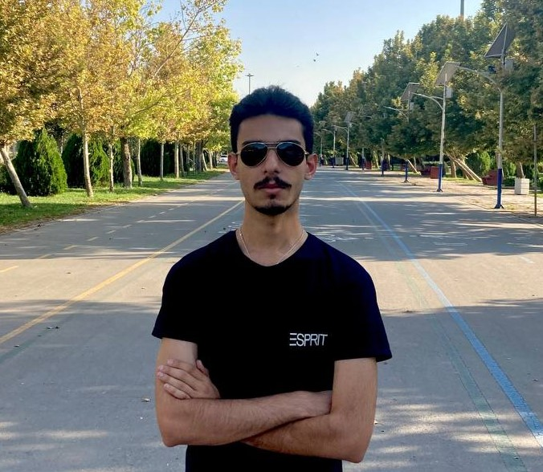

## Hi there, I'm Fazel! 

  

  

Computer Engineering student at BNUT - Babol Noshirvani University of Technology, I am all fascinated by technology and currently I am trying my best to become a data scientist.

## How to reach me 

  &nbsp;
  &nbsp;
  

## Languages/Frameworks and Technologies I am learning/using 

- Python 
- Data Science 
- Git 
- GitHub 
- Visual Studio Code 

## A little more about me 

- I'm currently working in a friendly organization named Cein Company. [:link:](https://github.com/Cein-Company) 
- I love to learn new things, work in groups, and gain new experiences. 
- I'm studying Computer Engineering right now and trying to improve my skills. 

## My data on GitHub 

  <a href="https://github.com/FazelHaghighi">
  
  

