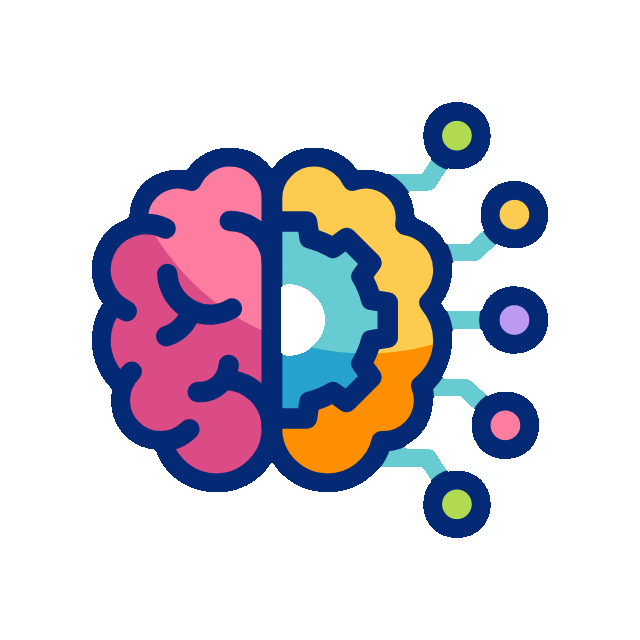

  <h1>MohammadFazel Abdhaghighi</h1>
  
Computer Engineer & Neuroscience Enthusiast

  

###  About Me

I like using math and code to figure out how complex systems work. I am comfortable working with any form of data, but I mostly enjoy the research process itself.

###  Research Focus

*   **Computational Neuroscience:** Modeling neural data, brain-computer interfaces, and cognitive systems.
*   **Machine Learning:** Graph Neural Networks (GNNs), deep learning, and predictive modeling.
*   **Data Science:** Working with high-dimensional data like EEG signals to extract patterns.

###  Get in Touch

If you want to chat about research or just connect, feel free to reach out:

*    [Email](mailto:fazel.haghighi1399@gmail.com)
*    [LinkedIn](https://www.linkedin.com/in/mohammadfazel-abdhaghighi/)
*    [Telegram](https://t.me/GitTheForkOffMe)

---

###  GitHub Activity

*Since my focus has shifted more toward research, my commit history might be a bit quieter these days.*

  
   
  

